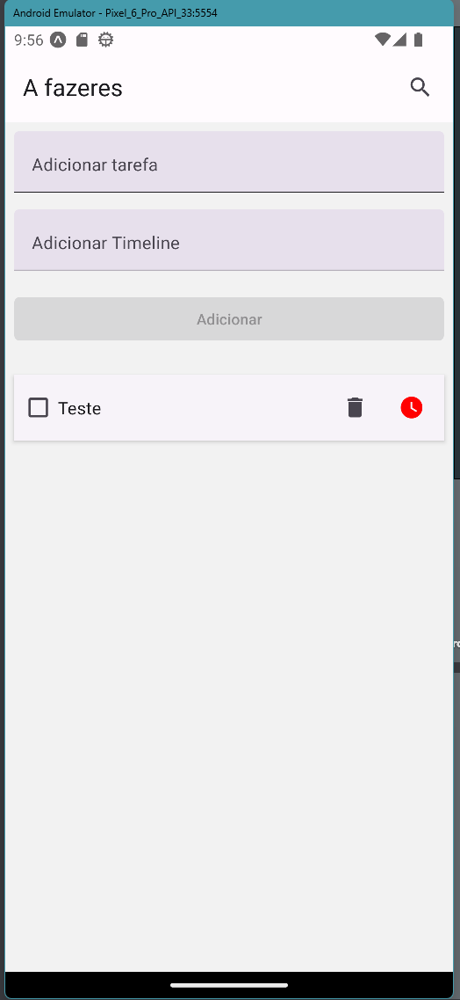
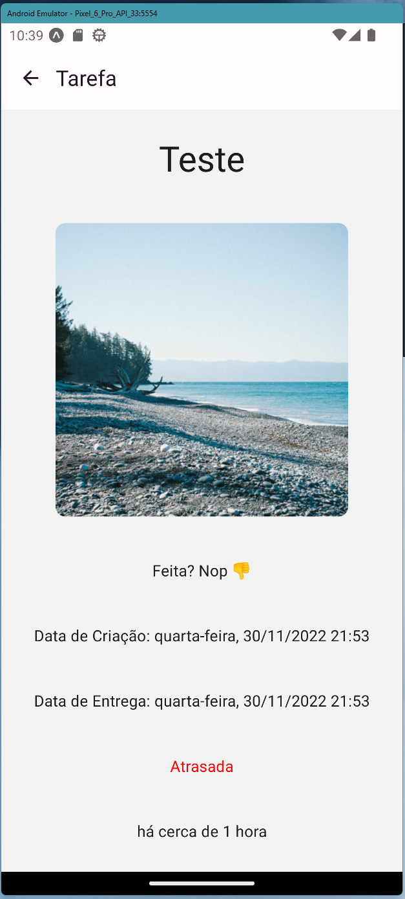

# Atividade React Native

## Descrição

### Home

- [ ] A tarefa é adicionar mais um componente de texto, para que o possa adicionar uma deadline para a tarefa.
- [ ] Caso tarefa esteja atrasada, deve ser adicionado um ícone de relógio com a cor vermelha.

### Tarefa

- [ ] A data de entrega deve ser adicionada
- [ ] Uma atividade atrasada deve ser adicionado caso a data de entrega seja anterior a data atual.

